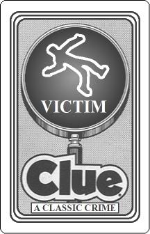
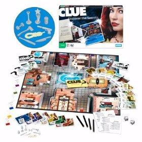

# WHO? HOW? WHERE?

## WDI_SM_21 Project One 
## A game using elements from the classic board Game 'Clue'



>** This game will test your memory and deductive reasoning.**

```
INSTRUCTIONS

1. You are the detective picked to solve this mystery
2. Two players will each take a turn guessing
3. Each player chooses one suspect, one weapon, and one room at each turn
4. The first player to correctly select the suspect, weapon, and room WINS

CONTENTS

* START/RESTART GAME BUTTON
* 6 Suspects
* 6 Weapons
* 6 Rooms
* Random layout of suspects, weapons, and rooms
* ONE WINNER
```
####**User Stories**

As a player, I want the game to be thoughtful and fun.

As a player, I control the flow and timing of the game. 

---
####**Game requirements:**
* Suspects, Weapons, Rooms
* Animation - images, buttons, etc.
* Correct suspect, weapon & room WINS

---
####**Future Implementation:**
* More suspects, weapons, or rooms
* Music / more Sound FX
* Choose a player detective? (e.g., Holmes, Peirot, Marple, Colombo) And, enter name.
* Add third (or more) player(s)
* Improve styling - limiting selections

---
####**Technologies/Frameworks:**
* HTML
* CSS
* jQuery

---
####**Credits:**
Artwork/creative from [The Art of Murder](http://www.theartofmurder.com/) website was very instrumental in making this game possible. Coding help from the following:

 * [Fisher-Yates shuffle](https://en.wikipedia.org/wiki/Fisher%E2%80%93Yates_shuffle)
 * [SweetAlert](http://t4t5.github.io/sweetalert/)
 * [BFXR](http://www.bfxr.net/)
 * [SoundBible.com](http://soundbible.com/about.php)

---
This screen shot shows elements of the game with the background and card layout.


I originally started the game with a few suspects and weapons. Once the variables and functions were in place, I was able to scale the game to include more suspects, weapons, and add rooms.
